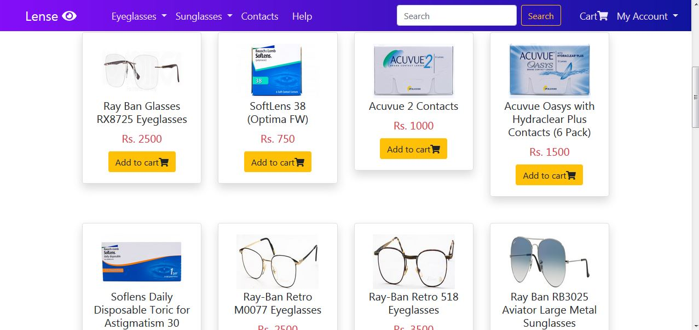

# Lense Shopping Portal

The Project entitled "LENSE SHOPPING PORTAL" is a web-based application Software developed in PHP using HTML/CSS, Bootstrap,  JavaScript as front end. The main aim of "LENSE SHOPPING PORTAL" is to improve the services of Customers and vendors. It maintains the details of customer payments, product receipts, addition of new customers, products and also updating, deletion for the same. 





## Live Demo

View Website [here](http://lenseshoppingportal.epizy.com/)


## Getting Started

To get this project download the repository or clone it.

```
$ cd <xampp/htdocs>
```

```
$ git clone https://github.com/imbalkur/lenseshoppingportal.git
```

### Prerequisites

Download xampp in your your local computer.

### Installing

- Clone the repository in your xampp htdocs folder.
- Open xampp and start mysql and apache service.

## Running the tests

Open browser of your choice type [localhost/lenseshoppingportal/](localhost/lenseshoppingportal/) on the search bar.

## Author

👤 **Manjushree Balkur** - [@imbalkur](https://github.com/imbalkur)

## Built with

* HTML/CSS,Bootstrap 4
* Javascript
* [XAMPP](https://www.apachefriends.org/index.html)
* PHP
* MySQL
